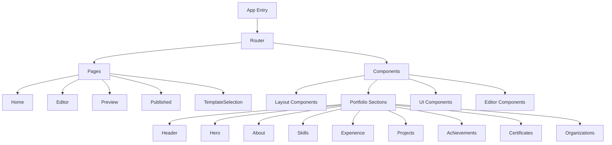
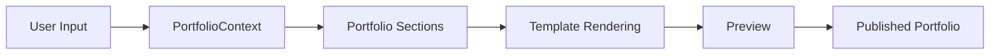

# Portfolio Builder

A modern, feature-rich portfolio builder application that helps professionals create and manage their online portfolios with ease.

## 🌟 Features

- 📝 Multiple template options (Modern, Creative, Minimalist, etc.)
- 🎨 Customizable sections (About, Skills, Experience, Projects, etc.)
- 📱 Responsive design
- 🔄 Real-time preview
- 🚀 Easy publishing and sharing
- 🎯 SEO-friendly portfolio pages

## 🏗️ Architecture



## 🛠️ Technology Stack

- **Frontend Framework**: React
- **Build Tool**: Vite
- **Styling**: TailwindCSS
- **Routing**: React Router DOM
- **State Management**: React Context API
- **Code Quality**: ESLint
- **Development Environment**: Node.js

## 📦 Project Structure

```
portfolio-builder/
├── src/
│   ├── assets/          # Static assets
│   ├── components/      # Reusable components
│   │   ├── editor/     # Portfolio editor components
│   │   ├── layout/     # Layout components
│   │   ├── portfolio-sections/ # Portfolio section components
│   │   └── ui/         # UI components
│   ├── context/        # React Context providers
│   ├── pages/          # Application pages
│   ├── templates/      # Portfolio templates
│   ├── utils/          # Utility functions
│   ├── App.jsx         # Root component
│   └── main.jsx        # Entry point
├── public/             # Public assets
├── index.html          # HTML template
├── vite.config.js      # Vite configuration
├── package.json        # Dependencies and scripts
└── README.md          # Project documentation
```

## 🚀 Getting Started

### Prerequisites

- Node.js (v16 or higher)
- npm or yarn

### Installation

1. Clone the repository:
```bash
git clone <repository-url>
cd portfolio-builder
```

2. Install dependencies:
```bash
npm install
```

3. Start the development server:
```bash
npm run dev
```

The application will be available at `http://localhost:5173`

## 🔧 Available Scripts

- `npm run dev` - Start development server
- `npm run build` - Build for production
- `npm run preview` - Preview production build
- `npm run lint` - Run ESLint

## 🌊 Data Flow



## 📝 Component Architecture

### Portfolio Context
The application uses React Context API for state management. The main context is `PortfolioContext` which provides:

- Portfolio data structure
- Section management functions
- Template selection
- Content updating methods

### Templates
Available portfolio templates:
- Blank Canvas
- Modern
- Creative
- Minimalist
- Professional
- Developer

### Sections
Each portfolio can include:
- Header with navigation
- Hero section
- About information
- Skills showcase
- Work experience
- Projects gallery
- Achievements
- Certificates
- Organizations

## 🎯 Future Enhancements

1. **Authentication & User Management**
   - User registration and login
   - Portfolio data persistence
   - Multiple portfolio support

2. **Enhanced Customization**
   - Custom color schemes
   - Font selection
   - Layout customization

3. **Analytics Integration**
   - View tracking
   - Visitor analytics
   - Performance metrics

4. **Export Options**
   - PDF export
   - Offline version
   - Custom domain support

## 🤝 Contributing

1. Fork the repository
2. Create your feature branch (`git checkout -b feature/AmazingFeature`)
3. Commit your changes (`git commit -m 'Add some AmazingFeature'`)
4. Push to the branch (`git push origin feature/AmazingFeature`)
5. Open a Pull Request


